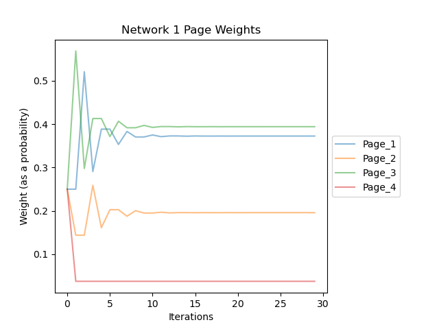
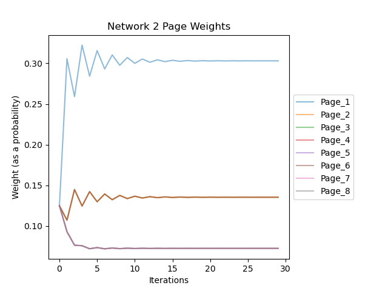
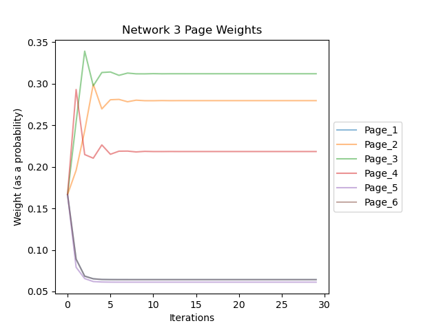
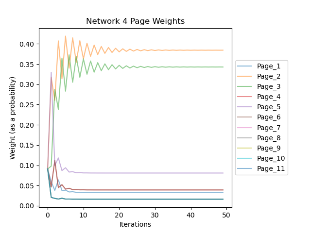

# Page Rank

### Overview

This repository serves as a demonstration of the page rank algorithm. In this implementation we do not use matrices but
instead only use predefined classes and constructs to implement the algorithm. This is less efficient runtime but more
clearly showcases the process of the page rank algorithm.

A series of example inputs are provided [here](./example_networks) which define networks taken from a variety
of sources:

- [Network 1 Source](https://www.ccs.neu.edu/home/vip/teach/IRcourse/4_webgraph/notes/Pagerank%20Explained%20Correctly%20with%20Examples.html) (
  example 1 of this page)
- [Network 2 Source](https://www.ccs.neu.edu/home/vip/teach/IRcourse/4_webgraph/notes/Pagerank%20Explained%20Correctly%20with%20Examples.html) (
  example 2 of this page)
- Network 3 is based off a university lecture slide so expected weights will not be provided
- [Network 4 Source](https://en.wikipedia.org/wiki/PageRank) (example given on the right hand side of page)

### Results

The results of running the page rank algorithm on each network are given in this section. Each page in every example
successfully converged to the expected values seen in the sources. The calculated and expected values will also be
listed.

---

##### Network 1

| Page Id | Calculated Weight | Expected Weight (Scaled) |
|---------|-------------------|--------------------------|
| 1       | 0.372527          | 0.3725                   |
| 2       | 0.195824          | 0.195                    |
| 3       | 0.394149          | 0.395                    |
| 4       | 0.0375            | 0.0375                   |

Note: the scaled weights were calculated by dividing each weight by the sum of all weights.

___

##### Network 2

| Page Id | Calculated Weight | Expected Weight (Scaled) |
|---------|-------------------|--------------------------|
| 1       | 0.302947          | 0.3036                   |
| 2       | 0.135472          | 0.1353                   |
| 3       | 0.135472          | 0.1353                   |
| 4       | 0.135472          | 0.1353                   |
| 5       | 0.0726596         | 0.0726                   |
| 6       | 0.0726596         | 0.0726                   |
| 7       | 0.0726596         | 0.0726                   |
| 8       | 0.0726596         | 0.0726                   |

___

##### Network 3

| Page Id | Calculated Weight |
|---------|-------------------|
| 1       | 0.0642919         |
| 2       | 0.279683          |
| 3       | 0.312046          |
| 4       | 0.218436          |
| 5       | 0.0612511         |
| 6       | 0.0642919         |

___

##### Network 4

| Page Id | Calculated Weight | Expected Weight |
|---------|-------------------|-----------------|
| 1       | 0.0327815         | 0.033           |
| 2       | 0.384401          | 0.384           |
| 3       | 0.34291           | 0.343           |
| 4       | 0.0390871         | 0.039           |
| 5       | 0.0808857         | 0.081           |
| 6       | 0.0390871         | 0.039           |
| 7       | 0.0161695         | 0.016           |
| 8       | 0.0161695         | 0.016           |
| 9       | 0.0161695         | 0.016           |
| 10      | 0.0161695         | 0.016           |
| 11      | 0.0161695         | 0.016           |

